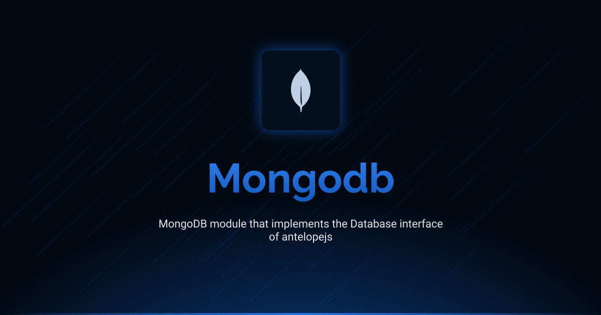

# @antelopejs/mongodb

[](https://www.npmjs.com/package/@antelopejs/mongodb)
[](https://opensource.org/licenses/Apache-2.0)
[](https://www.typescriptlang.org/)

A full-featured MongoDB client module that implements both the MongoDB interface and the Database interface for AntelopeJS.

## Installation

```bash
ajs project modules add @antelopejs/mongodb
```

## Interfaces

This module implements two key interfaces:

- **MongoDB Interface**: Provides direct MongoDB operations and connection management
- **Database Interface**: Offers a standardized database abstraction layer

Both interfaces can be used independently or together depending on your application's needs. The interfaces are installed separately to maintain modularity and minimize dependencies.


| Name          | Install command                         |                                                                   |
| ------------- | --------------------------------------- | ----------------------------------------------------------------- |
| MongoDB       | `ajs module imports add mongodb`        | [Documentation](https://github.com/AntelopeJS/interface-mongodb)  |
| Database      | `ajs module imports add database`       | [Documentation](https://github.com/AntelopeJS/interface-database) |


## Overview

The AntelopeJS MongoDB module provides functionality for interacting with MongoDB:

- MongoDB client connection management through the MongoDB interface
- Common database operations through the Database interface

## Configuration

The MongoDB module supports connection using the native MongoDB driver with the following options:

```typescript
// MongoDB connection options
{
    url: "mongodb://localhost:27017",     // The MongoDB connection string
    id_provider: "uuid",                  // ID generation strategy: "uuid" (default) or "objectid"
    options: {                            // Optional MongoDB client options
        useNewUrlParser: true,
        useUnifiedTopology: true,
        maxPoolSize: 10,                  // Maximum number of connections in the pool
        connectTimeoutMS: 30000,          // Connection timeout in milliseconds
        socketTimeoutMS: 30000            // Socket timeout in milliseconds
    }
}
```

### Configuration Details

The module uses the official MongoDB Node.js driver to establish connections to your MongoDB servers:

- Connection using `MongoClient.connect()` from the mongodb package
- Support for standard MongoDB connection options
- Built-in connection pooling through the MongoDB driver
- ID generation strategies:
  - `uuid` (default): Uses UUID v4 for generating unique identifiers
  - `objectid`: Uses MongoDB's native ObjectId for document identifiers

## License

This project is licensed under the Apache License 2.0 - see the [LICENSE](LICENSE) file for details.
