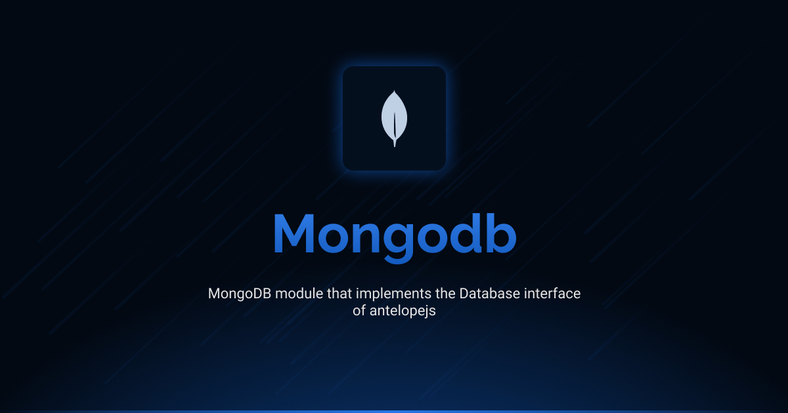

# @antelopejs/mongodb

<div align="center">
<a href="https://www.npmjs.com/package/@antelopejs/mongodb"></a>
<a href="./LICENSE"></a>
<a href="https://discord.gg/sjK28QHrA7"></a>
<a href="https://antelopejs.com/modules/mongodb"></a>
</div>

A full-featured MongoDB client module that implements both the MongoDB interface and the Database interface for AntelopeJS.

## Installation

```bash
ajs project modules add @antelopejs/mongodb
```

## Interfaces

This module implements two key interfaces:

- **MongoDB Interface**: Provides direct MongoDB operations and connection management
- **Database Interface**: Offers a standardized database abstraction layer

Both interfaces can be used independently or together depending on your application's needs. The interfaces are installed separately to maintain modularity and minimize dependencies.

| Name     | Install command                   |                                                                   |
| -------- | --------------------------------- | ----------------------------------------------------------------- |
| MongoDB  | `ajs module imports add mongodb`  | [Documentation](https://github.com/AntelopeJS/interface-mongodb)  |
| Database | `ajs module imports add database` | [Documentation](https://github.com/AntelopeJS/interface-database) |

## Overview

The AntelopeJS MongoDB module provides functionality for interacting with MongoDB:

- MongoDB client connection management through the MongoDB interface
- Common database operations through the Database interface

## Configuration

The MongoDB module supports connection using the native MongoDB driver with the following options:

```typescript
// MongoDB connection options
{
    url: "mongodb://localhost:27017",     // The MongoDB connection string
    id_provider: "uuid",                  // ID generation strategy: "uuid" (default) or "objectid"
    options: {                            // Optional MongoDB client options
        useNewUrlParser: true,
        useUnifiedTopology: true,
        maxPoolSize: 10,                  // Maximum number of connections in the pool
        connectTimeoutMS: 30000,          // Connection timeout in milliseconds
        socketTimeoutMS: 30000            // Socket timeout in milliseconds
    }
}
```

### Configuration Details

The module uses the official MongoDB Node.js driver to establish connections to your MongoDB servers:

- Connection using `MongoClient.connect()` from the mongodb package
- Support for standard MongoDB connection options
- Built-in connection pooling through the MongoDB driver
- ID generation strategies:
  - `uuid` (default): Uses UUID v4 for generating unique identifiers
  - `objectid`: Uses MongoDB's native ObjectId for document identifiers

## Atomic single-record mutations

`Table.atomicMutation(id, request)` implements the shared database interface contract with native `updateOne` and `deleteOne` commands. Each command matches one schema, table, instance, record identity, and condition. It never upserts. `CROSS_INSTANCE`, selections, and query-expression inputs are not supported.

Revision updates replace the supplied top-level fields, including whole nested objects, and install a required new revision in the same command. Patch values are literal data, not MongoDB expressions. Patches cannot change `id`, `_id`, `_instance`, or the revision field. Callers must use fresh revision tokens and must not reuse a deleted record's identity for a different incarnation.

A string revision matches exactly. `{ kind: "missing" }` matches only an existing record with an absent revision field; stored `null` does not match. `deleteIfEqual` deletes only when one field equals the supplied string, finite number, boolean, or valid `Date`. It rejects arrays and missing fields as matches and does not provide revision-based protection against a value changing away and back.

Acknowledged matches return `applied`; acknowledged misses return `not-applied`, including a wrong instance or missing record. An unacknowledged result or uncertain driver error returns `unknown`, which must not be interpreted as failure to write or automatically retried. Input validation errors throw before dispatch; known server validation failures also throw. The adapter uses a separate lazy MongoDB client with `retryWrites` and `retryReads` disabled, preserving the existing client's retry configuration. The additional client uses the configured connection and pool options and closes when the adapter disconnects.

### Identity uniqueness spans instances

All instances of a schema/table share a collection. MongoDB's existing `_id` unique index therefore applies across those instances, not separately within each tenant. A normal insert without a conflict mode throws a duplicate-key error instead of overwriting an existing record, including when another instance owns that identity. Use globally unique record identities within each schema/table. This change does not migrate identities or alter indexes.

### Interface prerequisite

This implementation requires `@antelopejs/interface-database` version `0.1.5` or later within the supported range. Version `0.1.5` provides the atomic mutation contract introduced in [interface-database PR #15](https://github.com/AntelopeJS/interface-database/pull/15). Earlier versions do not provide this capability.

## License

This project is licensed under the Apache License 2.0 - see the [LICENSE](LICENSE) file for details.
